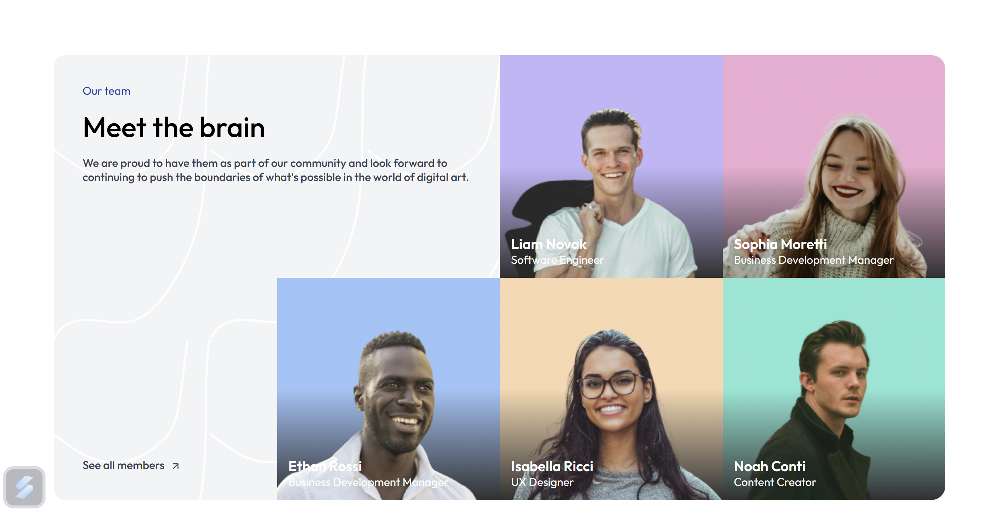
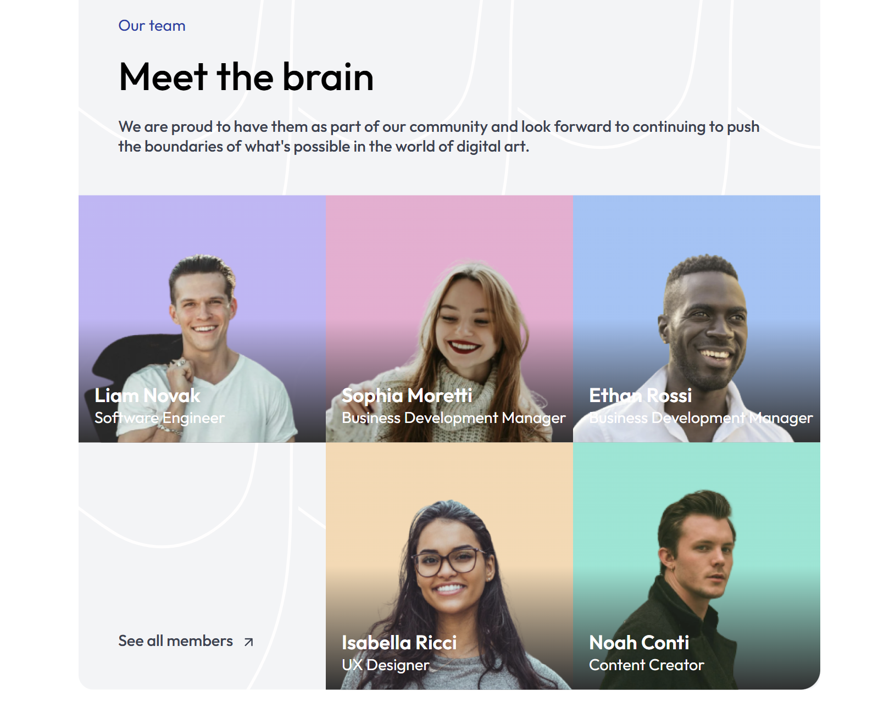
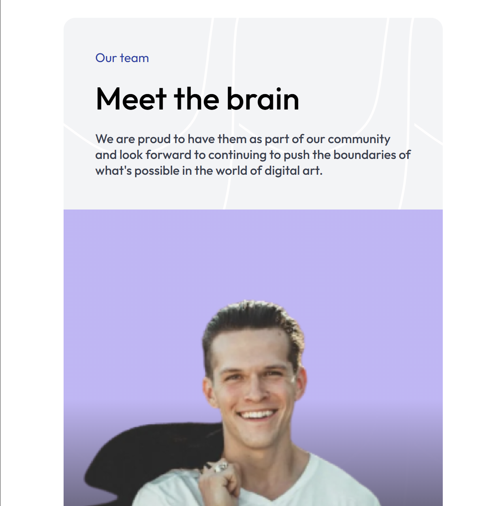

# Meet The Team

## Overview
This project is a responsive **"Meet The Team"** section built with **HTML** and **CSS**. It showcases a team of professionals in a modern grid-based layout. The design adapts to different screen sizes, ensuring a great user experience across devices.

## Features
- **Responsive Grid Layout** using CSS Grid
- **Elegant Typography** with Google Fonts (Outfit)
- **Gradient Backgrounds** for each team member
- **Mobile-Friendly Design**

## Technologies Used
- HTML
- CSS
- Google Fonts

## File Structure
```
├── index.html  # Main HTML file
├── style.css   # Styling file
├── resources/  # Images & assets
│   ├── person_1.png
│   ├── person_2.png
│   ├── person_3.png
│   ├── person_4.png
│   ├── person_5.png
│   ├── arrow_up_right.svg
│   ├── Background_decor.svg
```

## Installation & Usage
1. **Clone the repository:**
   ```sh
   git clone https://github.com//meetTheTeam.git
   ```
2. **Open `index.html` in a browser**

## Responsive Design
- **Desktop (1024px and above):** 4-column grid layout
- **Tablet (≤1024px):** 3-column grid layout
- **Mobile (≤640px):** Single-column stacked layout

## Screenshots
**Dekstop view**


**Tablet view**


**Mobile view**

## Customization
- Modify `style.css` to change colors, fonts, or layout.
- Replace images in the `resources/` folder to update team members.

## Author
Developed by **Ronny Ardiansyah**

